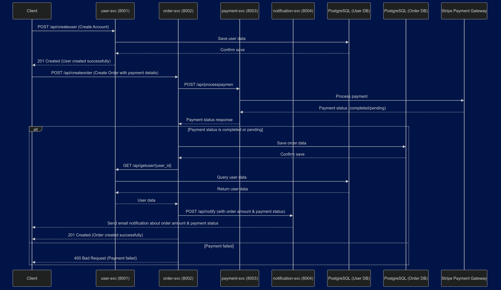

# Microservices Architecture & Keploy Contract Testing

This project consists of four intercommunicating microservices built using *Golang*. It showcases contract testing with **Keploy**.  

### Microservices Overview  
1. **user-svc** – Manages user-related operations.  
2. **order-svc** – Handles order processing and management.  
3. **payment-svc** – Processes transactions and payments.  
4. **notification-svc** – Sends notifications to users. 

## Architecture



## API Details

### 1. User Service (`user-svc`)  
The User Service is responsible for creating new users and providing user data to the Notification Service when notifications need to be sent.  

- **PORT:** 8001  
- **Endpoints:**  
    - `POST /api/createuser`  
      **Description:** Creates a new user.  
      **Request Body:**  
      ```json
      {
          "name": "string",
          "email": "string"
      }
      ```
    - `GET /api/getuser/{user_id}`  
      **Description:** Retrieves user details by ID.  
      
    - `GET /api/getusers`  
      **Description:** Fetches a list of all users.  

### How It Interacts  
The User Service communicates with other microservices as follows:  
- The **Notification Service** queries the User Service to fetch user details when sending notifications.  
- Other services can retrieve user data as needed to facilitate their operations.  
---

### 2. Order Service (`order-svc`)  
The Order Service handles order creation and processes payment-related details before finalizing an order.  

- **PORT:** 8002  
- **Endpoints:**  
    - `POST /api/createorder`  
      **Description:** Creates a new order after the user fills in all necessary details.  
      **Request Body:**  
      ```json
      {
          "user_id": "string",
          "item": "string",
          "amount": "int",
          "status": "string"
      }
      ```
    - `GET /api/order/{user_id}`  
      **Description:** Retrieves details of a specific order.  

    - `GET /api/orders`  
      **Description:** Fetches all orders.  

### How It Interacts  
- The **Order Service** receives a request from the user to place an order.  
- It then interacts with the **Payment Service** to process the payment via **Stripe**.  
- Based on the payment status (completed/pending), it finalizes the order and stores it in a separate database.  
- It then requests the **User Service** for the user's email.  
- Finally, it sends order details to the **Notification Service** to inform the user about the order status.  

---

### 3. Payment Service (`payment-svc`)  
The Payment Service processes transactions using **Stripe** as the payment gateway.  

- **PORT:** 8003  
- **Endpoints:**  
    - `POST /api/processpayment`  
      **Description:** Handles payment processing.  
      **Request Body:**  
      ```json
      {
          "user_id": "string",
          "item": "string",
          "amount": "int",
          "status": "string"
      }
      ``` 

### How It Interacts  
- The **Order Service** calls the **Payment Service** to process the payment.  
- The **Payment Service** interacts with **Stripe** to complete the transaction.  
- It returns a response indicating whether the payment is **completed** or **pending**.  
- The **Order Service** then uses this status to determine the next steps.  

---

### 4. Notification Service (`notification-svc`)  
The Notification Service is responsible for informing users about their payment status and order confirmation  

- **PORT:** 8004  
- **Endpoints:**  
    - `POST /api/notify`  
      **Description:** Sends notifications to users about payment and order status.  
      **Request Body:**  
      ```json
      {
          "email": "string",
          "order_id": "string",
          "amount": "string"
      }
      ``` 

### How It Interacts  
- The **Order Service** provides the user's email and order details to the **Notification Service**.  
- The **Notification Service** then sends an email or other notifications to the user, informing them about:  
  - The **payment status** (completed or pending).  
  - The **successful creation of their order**.  

## 🛠️ Tech Stack   
- **Golang** – Used for building all microservices  
- **Gorilla Mux** – Handles HTTP request routing  
- **GORM** – ORM for database operations  
- **PostgreSQL** – Database used by the Order Service  
- **Stripe API** – Secure payment processing  
- **SMTP (Gmail SMTP Server)** – Sends email notifications   

---
## Setting Up the Project  

To set up and run this microservices-based project locally, follow these steps:  

### Clone the Repository  
First, clone the project from GitHub:  

```sh
git clone https://github.com/thecodephilic-guy/microservices.git
cd microservices
```
### Configure Environment Variables
Each service contains a .env file that holds essential configuration details. Make sure to create these files inside each service directory and provide the necessary values.

**User & Order Services (user-svc, order-svc)**

Both services require a database connection string:
```bash
DATABASE_URL=your_postgres_connection_string
```
**Payment Service (payment-svc)**

The payment service requires a Stripe Secret Key for handling transactions:
```bash
STRIPE_SECRET_KEY=your_stripe_secret_key
```

**Notification Service (notification-svc)**

The notification service uses SMTP credentials for sending emails:
```bash
SMTP_HOST=smtp.gmail.com
SMTP_PORT=587
SMTP_EMAIL=your_email@gmail.com
SMTP_PASSWORD=your_email_password
```

### Install Dependencies
Ensure you have Golang installed, then install dependencies for each service. Navigate into each service directory and run:
```bash
go mod download
```

### Run the Services

Each microservice runs on a different port. Start them individually by navigating into each service folder and running:
```bash
go run main.go
```
